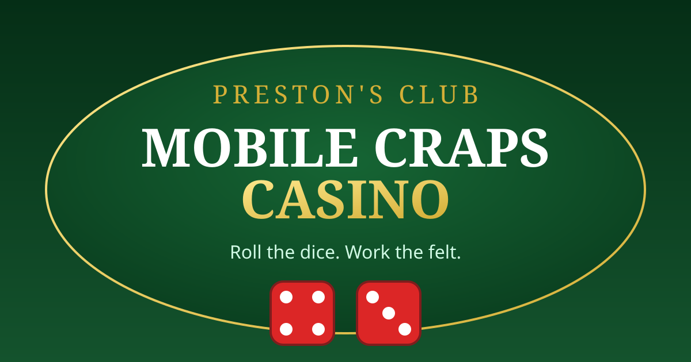

# Mobile Craps Casino

A full craps table built for your phone — roll the dice and work the felt.

**Play it live:** https://prestonross88.github.io/mobile-craps-casino/

## How to Play

1. **Pick a chip** ($1, $5, $25, $100).
2. **Tap the table** to place bets:
   - **Pass Line** — wins on 7/11 come-out, loses on 2/3/12; then needs the point before a 7
   - **Don't Pass Bar** — the dark side; wins when the shooter sevens out (pushes on 12)
   - **Field** — one-roll bet on 2, 3, 4, 9, 10, 11, 12 (2 and 12 pay double)
   - **Place 4, 5, 6, 8, 9, 10** — pays true odds when your number hits before a 7
3. **Roll the dice** (or press Space/Enter).
4. When a point is established, it's marked with a gold ★ and a glowing border.

Line bets lock once the point is on — just like a real table. Changed your mind? Toggle **Remove mode** and tap a bet to take it down.

## Features

- Complete craps rules engine: come-out rolls, points, seven-outs, pushes
- Gold star marker on the established point number
- Remove mode for taking down individual bets
- Dice, bet, win, and lose sound effects with mute toggle
- Keyboard control: `Space/Enter` to roll
- Bankroll, stats, and preferences saved between visits
- Session stats: rolls and biggest win
- Layout sized for phones — the roll button always fits on screen

## Details

- Single-file HTML game — no build step, no dependencies beyond a CDN
- All logic runs locally in your browser; nothing is sent anywhere
- Fun credits only — no real money involved

Built with a little help from Diablo. 🎲
